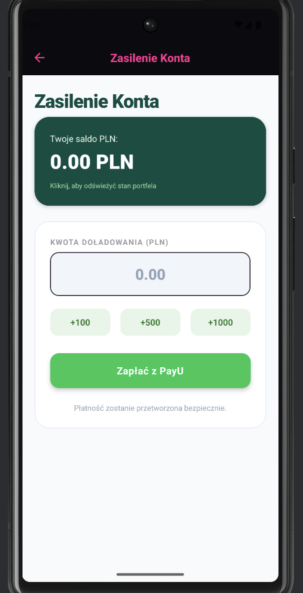
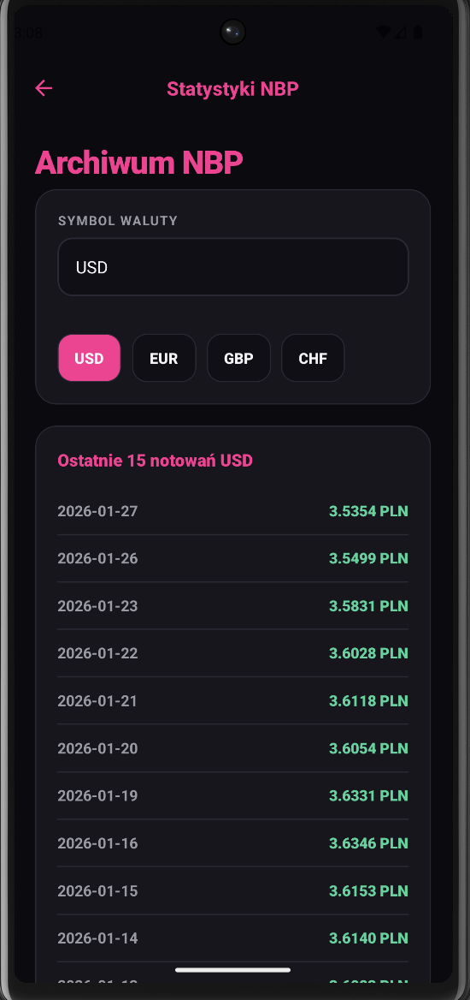

## System Transakcyjny „Elite-Kantor”

## Opis
- Projekt Elite-Kantor to nowoczesny symulator rynku walutowego w formie aplikacji na urządzenia przenośne.
- Narzędzie to pozwala użytkownikom na bezpieczne testowanie strategii wymiany walut w środowisku wirtualnym,
- wykorzystując do tego rzeczywiste notowania dostarczane przez NBP. Użytkownik może zarządzać własnym profilem,
- operować cyfrowym budżetem i monitorować zmiany rynkowe.
---

## Architektura
- **Aplikacja mobilna** – interfejs usera
- **Baza danych** – przechowywanie danych
- **Web Service (Backend)** – logika biznesowa i API
- **Zewnętrzne API** – publiczne API Narodowego Banku Polskiego

- Uzywane są **REST API** z **HTTPS** i formatu **JSON**.

---

## Funkcjonalności
- Rejestracja i logowanie
- Wirtualne konto ta jego doladowanie
- Aktualne i archiwalne kursy walut z API NBP
- Kupno i sprzedaż walut
- Historii transakcji
- Stan portfela walutowego

---

## Backend – odpowiedzialności
- Autoryzacja i uwierzytelnianie użytkowników
- Integracja z API NBP
- Walidacja danych wejściowych
- Przetwarzanie transakcji walutowych
- Zarządzanie danymi w bazie danych

---

## Baza danych
Aplikacja korzysta z relacyjnej bazy danych przechowującej:
- użytkowników
- salda portfeli walutowych
- historię transakcji
- aktualne i archiwalne kursy walut

---

## Instalacja i uruchomienie

### Wymagania
- Node.js (LTS)
- npm
- Expo CLI
- PowerShell

### Instalacja zależności
- W katalogu "mobile" projektu:
- cd mobile
- npm install

### Uruchomienie backendu (terminal 1)

- cd server >
- node app.js

### Uruchomienie aplikacji mobilnej (terminal 2)

- cd mobile >
- npm start

  
  
  
  
  
  
  
  

